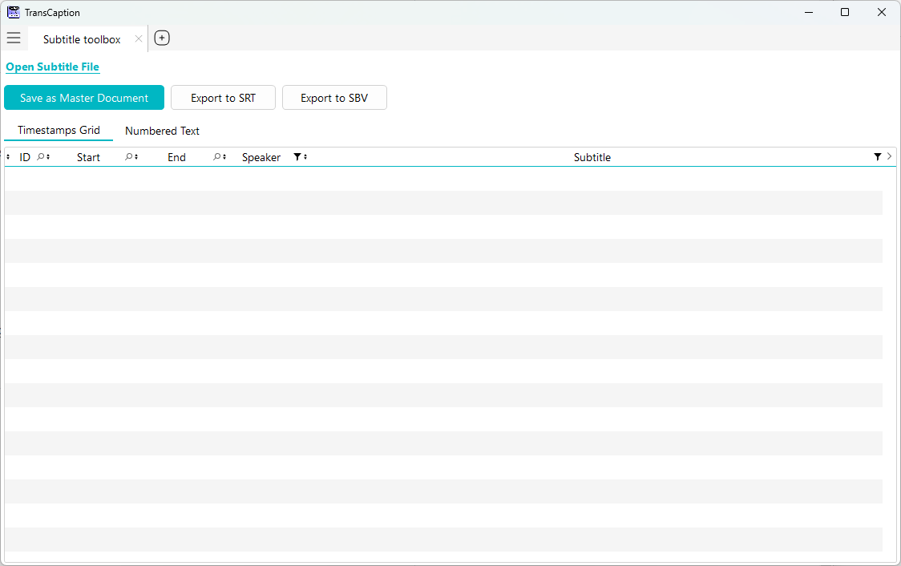
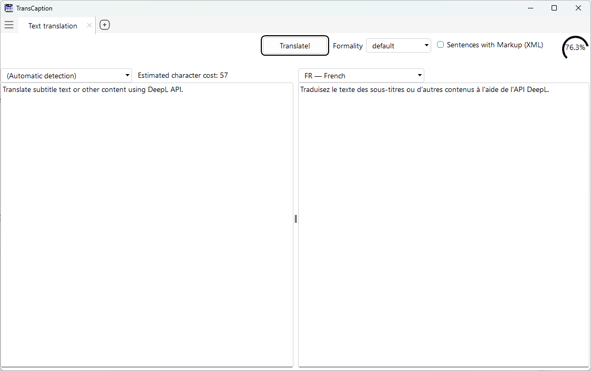
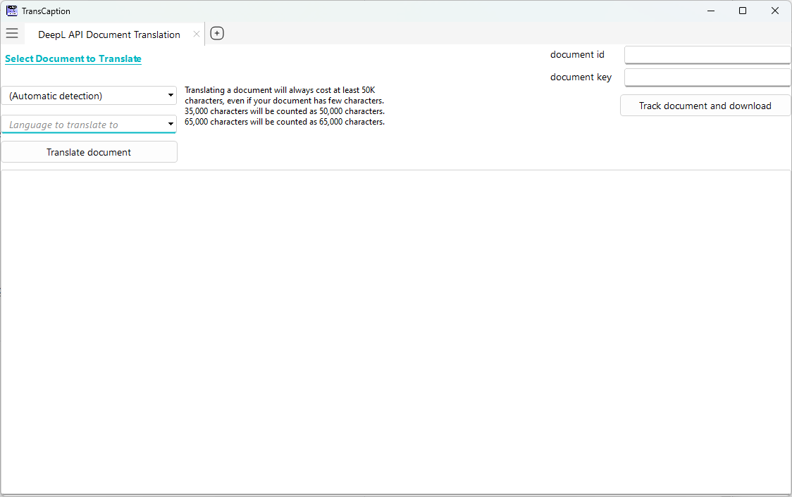

# TransCaption

Helping Content Creators with Translating Subtitles

**TransCaption** is a Windows application designed for creators and translators working with subtitles and multilingual content. It combines seamless subtitle editing for SRT and SBV formats with a simple interface for DeepL API-powered text and document translation. Additionally, it supports CSV export for compatibility with _ElevenLabs Dubbing AI_, streamlining subtitle workflows for platforms like YouTube, Davinci Resolve, and more.

## Features

- **Subtitle Editing**: Read, edit, and save subtitles in SRT and SBV formats with intuitive modes like Timestamps Grid and Numbered Text.
- **DeepL API Integration**: Translate text and documents effortlessly using DeepL’s advanced translation engine.
- **ElevenLabs Compatibility**: Export subtitle data as CSV files tailored for ElevenLabs Dubbing AI workflows.
- **Creator-Friendly**: Simplifies and optimizes subtitle translation for video content creators.

## Screenshots

### Caption Window
  
Edit and manage SRT/SBV subtitles with flexible display modes.

### Translate Window
  
Translate subtitle text or other content using DeepL API.

### Document Translate Window
  
Translate entire documents with ease via DeepL’s powerful engine.

## Getting Started

### Prerequisites
- Windows OS
- Optional: DeepL API key (for translation features)

### Installation
1. Simply download one of the released package.

## Usage
1. Open TransCaption and load an SRT or SBV file to edit subtitles.
2. Use the Text Translate tab for quick text translations or the Document Translation tab for full documents using DeepL API.
3. Export subtitles as SRT, SBV formats, or even CSV for ElevenLabs Dubbing product.

## Contributing

GitHub is used as a mirror from a Gitea repository.

This software has been developed with PCSoft WinDev. If you own the product, contributions are welcomed!

## License
This project is licensed under the [MPL 2.0](LICENSE).